# SCIT Payment Reminder & Reconciliation Agent: Complete Setup & Debugging Journey

This document provides a step-by-step walkthrough of how the automated payment reminder and reconciliation agent was configured, debugged, and finalized, complete with screenshots.

---

## Step 1: Initial State & Prerequisites
We started with an unpublished agent on the Zapier Agents dashboard.

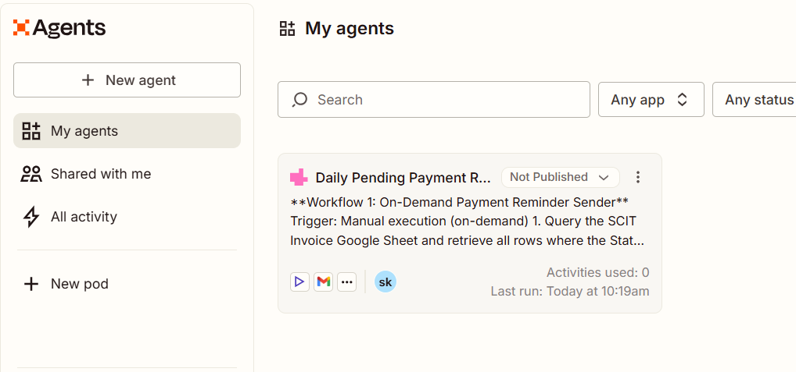

At the start, the **SCIT Invoice** Google Sheet was missing the `Email` column, which is necessary for the agent to find who to email and to reconcile replies.

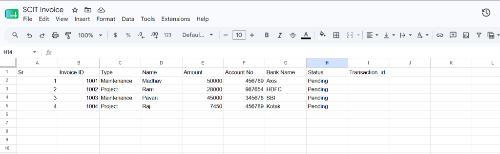

* **Fix applied**: We added an **Email** column (Column J) and filled it with recipient email addresses so the agent could target the right person and perform lookup matching.

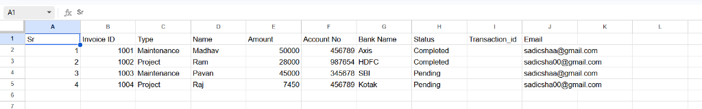

---

## Step 2: Creating the New Agent
We created a new agent in Zapier Central. It initially had no instructions, triggers, tools, or knowledge sources.

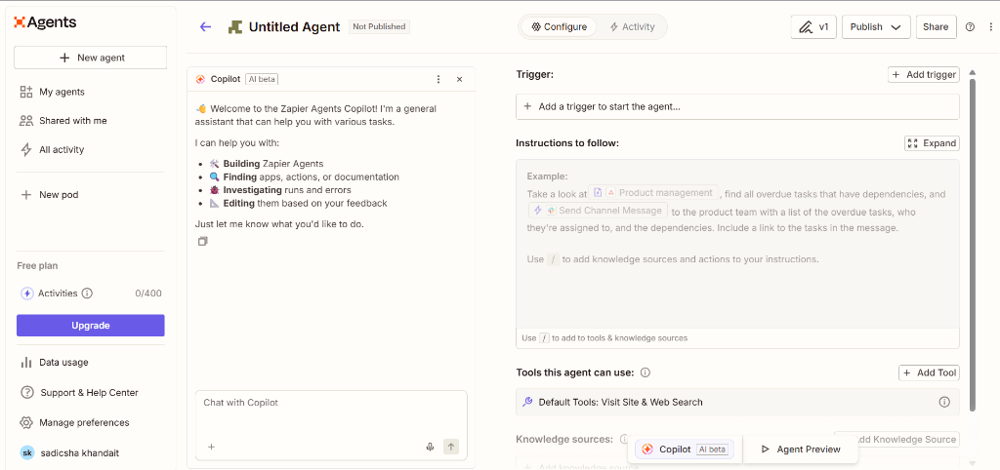

---

## Step 3: Connecting Tools & Knowledge Sources
We configured the agent to use:
* **Gmail** (Find Email & Send Email actions) as Tools.
* **Google Sheets** (SCIT Invoice spreadsheet) as a Knowledge Source (read-only).

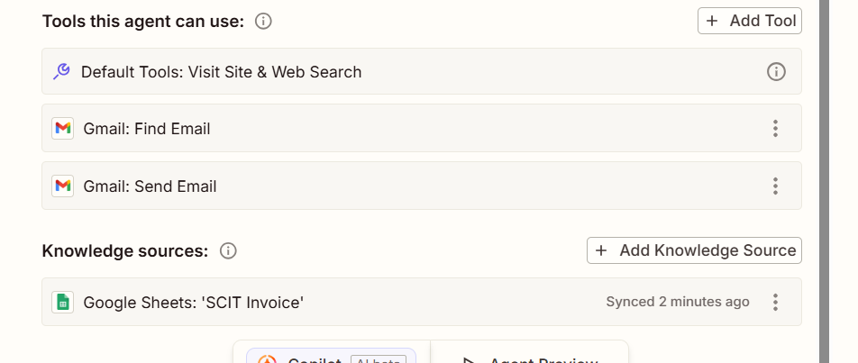

---

## Step 4: The First Test Run & Debugging
We pasted the instructions into the prompt box and ran our first manual test. The agent successfully sent the reminder email, but **failed to update the Google Sheet**.

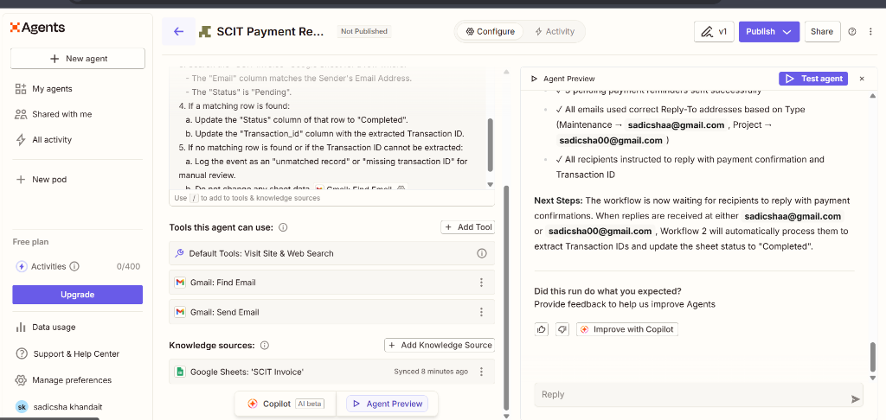

### The Issue
Because Google Sheets was only added as a **Knowledge Source** (which is read-only), the agent could not write data back to the sheet. 

* **Fix applied**: We added **Google Sheets** as a **Tool** with the `Update Spreadsheet Row(s)` action.

### Resolving the "Missing Row Number" Error
When we ran it again, the tool failed with a system error: `Required field "Row Number" (row_number) is missing`.

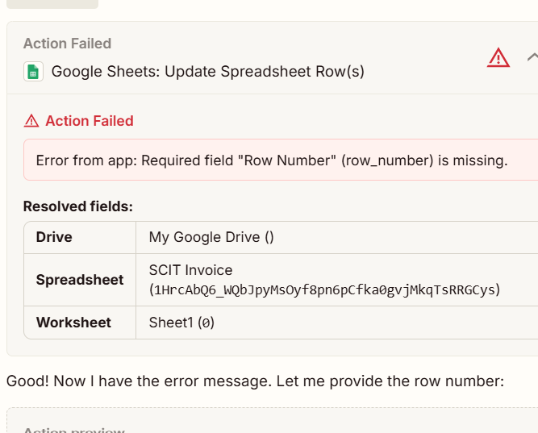

This occurred because the spreadsheet fields were dynamic and the Worksheet field was frozen.

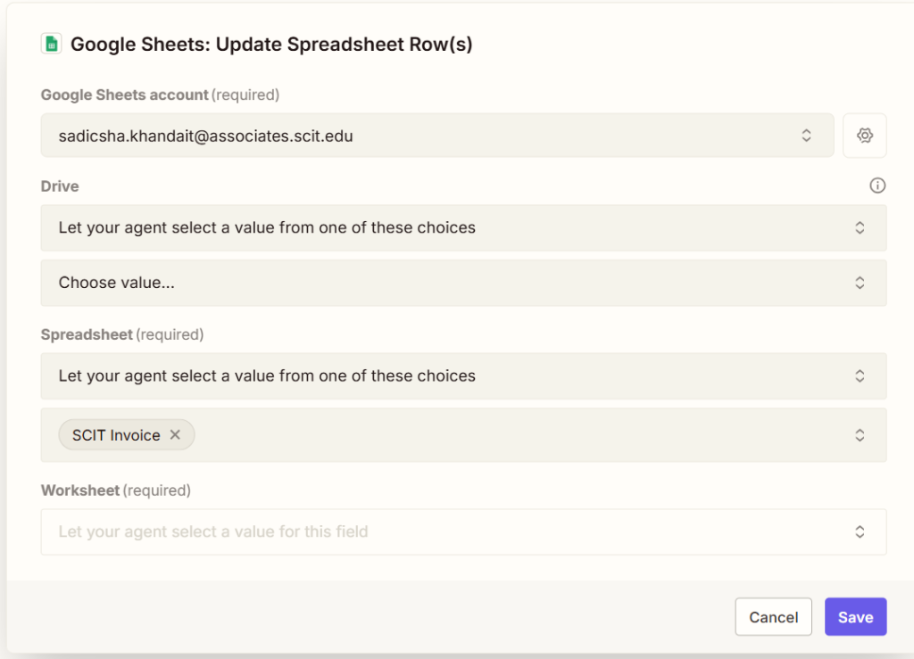

To unfreeze and configure the worksheet:
1. We changed the **Spreadsheet** dropdown setting from "Let your agent select a value..." to **"Set a specific value for this field"**.

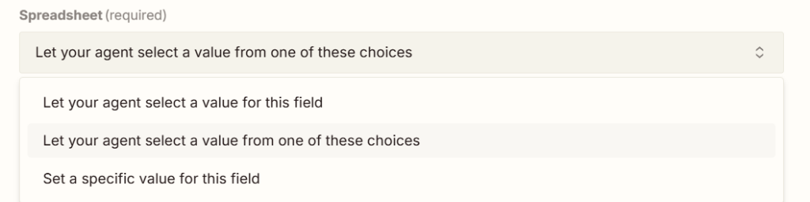

2. We did the same for the **Worksheet** field.

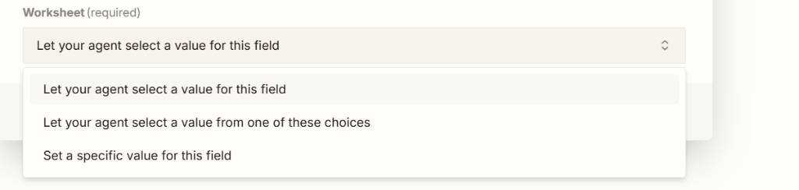

3. Once specific values were set, the column fields loaded correctly, enabling the AI to map them dynamically. We ensured the **Row** field was set to **"Let your agent select a value for this field"** so the AI could supply the row index (e.g. `4`).

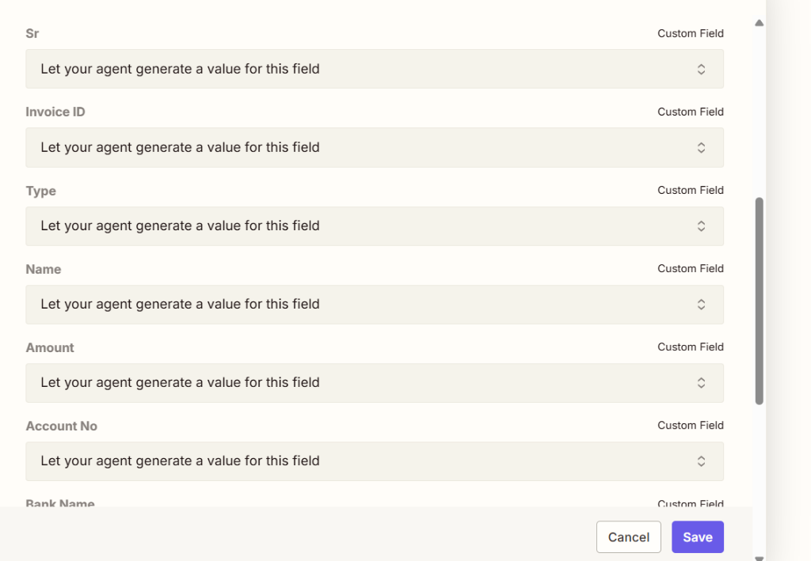

---

## Step 5: Successful Verification
With the Google Sheets tool fully configured, we ran the reconciliation test. The agent successfully processed the email replies, extracted the Transaction IDs, and updated the sheet!

* **Row 4 (Pavan)** updated from `Pending` to **`Completed`** with the transaction ID **`1235567`**.
* **Row 2 (Madhav)** reconciled successfully as well.
* **Row 5 (Raj)** remained `Pending` since no confirmation was received.

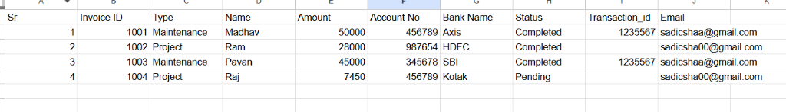

---

## Step 6: Going Live (Publishing)
Finally, we clicked the **Publish** button in the top right of the agent page to deploy it. The agent now runs completely automatically on the schedule and email triggers in the background!
